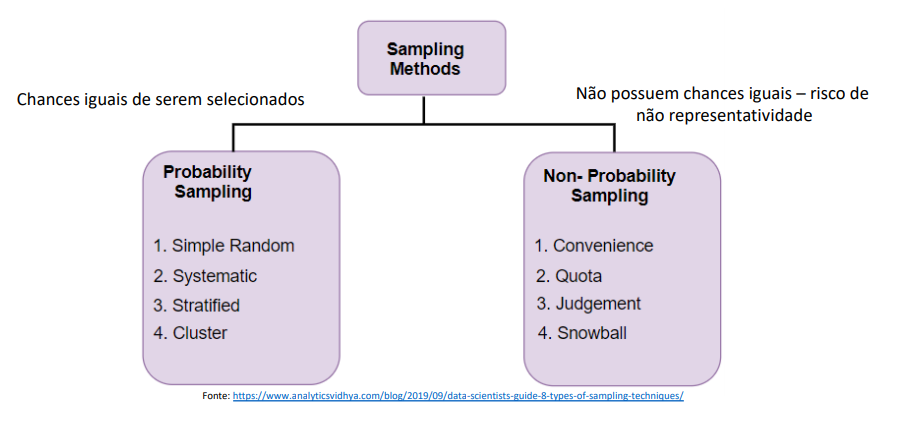
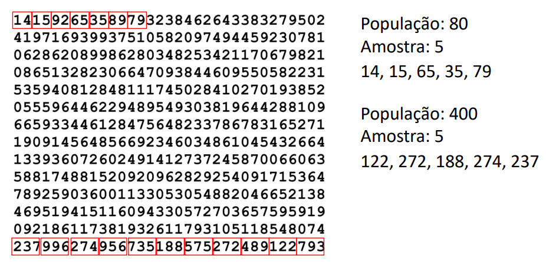

## Estatística para Ciência de Dados e Machine Learning - População e Amostra.

# POPULAÇÃO E AMOSTRA

- [1. População e amostra](#1-populacao-e-amostra)
- [2. Tabela de números aleatórios](#2-tabela-de-numeros-aleatorios)
- [3. Amostragem aleatória simples](#3-amostragem-aleatoria-simples)

## 1. População e amostra

A amostra é sempre menor que a população.
Mais rápido para processar.
Menor tempo para analisar.
Os números que são obtidos da amostra são as estatísticas.
A amostra precisa ser RANDÔMICA e REPRESENTATIVA.

  

  

## 2. Tabela de números aleatórios

  

## 3. Amostragem aleatória simples

Faça upload do notebook no Google Colab. O arquivo se encontra em: (amostragem/Amostragem.ipynb)

  

